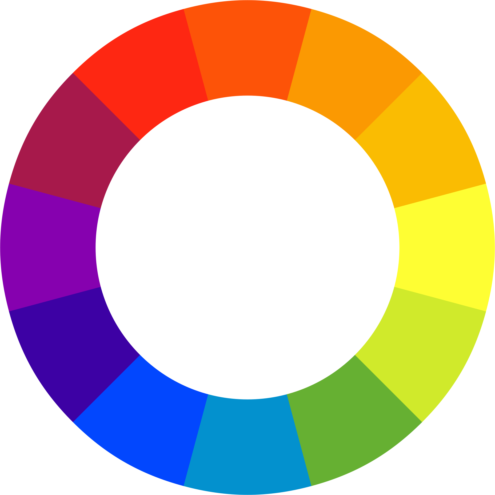

  

 

  
  

 

# ColourSpace Probe Match Verifier

A probe match verification tool for [ColourSpace].

## How-to

1. Perform a probe match as described in the [Probe Matching documentation](https://www.lightillusion.com/probe_matching.html) on the LightIllusion website.
2. Use the Manual Measure Tab to measure the same colours as during the probe match. Use can use these patch sets for [FULL]/Probe-Matching-Verification_FULL.csv) or [LEGAL / EXTENDED]/Probe-Matching-Verification_LEGAL_or_EXTENDED.csv).
3. Save this profile
4. Locate the reference meter profile (`.bpd`) as well as the profile saved from the manual measurements (`.bcs`). The `.bcs` files are usually found in `C:\Users\USERNAME\AppData\Roaming\ColourSpace\ColourSpaces`, the `.bpd` files should be in `C:\Users\USERNAME\AppData\Roaming\ColourSpace\MCGD`.
5. Copy these files somewhere outside of Windows system folders (e.g. `Desktop`), otherwise you won't be able to select them in the web application.
6. Load both files in the UI. The probe match verifier will compute whether the measurements are within Maximum Accepted Tolerance Levels (`+/- 0.001` for `x,y` as well as `+/- 1.5%` for `Y`).

[colourspace]: https://www.lightillusion.com/colourspace.html
